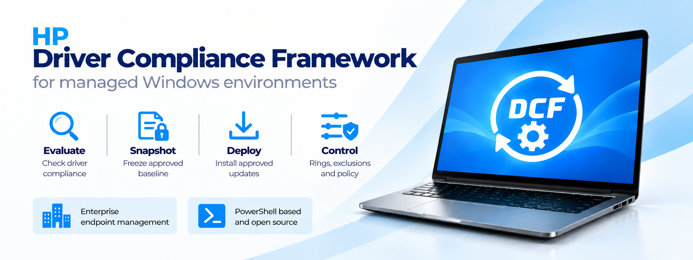

<p align="center">
  
</p>

<p align="center">
  <a href="https://learn.microsoft.com/powershell/"></a>
  <a href="https://www.microsoft.com/windows/"></a>
  <a href="https://ftp.ext.hp.com/pub/caps-softpaq/cmit/HPIA.html"></a>
  <a href="https://psappdeploytoolkit.com/"></a>
  <a href="LICENSE"></a>
  <a href="https://github.com/kekkutya/HP-Driver-Compliance-Framework/releases/latest"></a>
</p>

# HP Driver Compliance Framework

The **HP Driver Compliance Framework (HP-DCF)** is a Windows endpoint automation framework for controlled evaluation and deployment of HP driver, software, firmware, and accessory updates.

Current baseline: **Framework 1.0.5**, **DriverEvaluator 1.0.2**, **DriverDeployer 1.0.3**.

## Design

HP-DCF separates evaluation from deployment. DriverEvaluator runs HPIA Analyze/List and commits a validated, point-in-time SoftPaq snapshot. DriverDeployer later selects that frozen snapshot, applies Pilot/Broad rollout eligibility and current exclusions, and hands eligible work to the DriverDeployment PSADT. `-ForceAll` provides a separate direct-HPIA remediation path.

```text
User logon + 3 min
      |
      v
DriverEvaluator
      |
      v
Evaluation snapshot
      |
      v
DriverDeployer
      |
      +-- Normal / ForceRun --> DriverDeployment PSADT --> HPIA
      |
      +-- ForceAll ---------> HPIA directly
```

## Main components

| Component | Role |
|---|---|
| HP CMSL | HP management and HPIA lifecycle support used by the framework installer. |
| HPIA | Device analysis and actual remediation engine. |
| DriverEvaluator | List-only evaluation and frozen snapshot producer. |
| DriverDeployer | Ring/exclusion gates, deferred-resume logic and deployment orchestration. |
| DriverDeployment PSADT | Interactive/deferred SPList-based installation for Normal/ForceRun. |
| ADMX/ADML | Enterprise policy-backed registry configuration. |

## Fail-closed configuration

Normal operation requires explicit policy opt-in. Built-in defaults are:

```text
Framework Enabled       = False
DriverDeployer Enabled  = False
Ring                    = Broad
BroadDelayDays          = 21
Evaluation              = third Wednesday, no catch-up
```

Configuration root:

```text
HKLM\SOFTWARE\HPDriverComplianceFramework
```

## Installed runtime

```text
C:\HPIA\
├── Automation\
├── DriverDeployment\
├── HP Image Assistant\
└── IAReport\
    ├── Snapshots\
    └── Deployment\
```

## Getting started

For a minimal Pilot installation and first-run walkthrough, see the [Quick Start](docs/en/quick-start.md).

## Documentation

- [Quick Start](docs/en/quick-start.md)
- [Documentation index](docs/README.md)
- [Architecture](docs/en/architecture.md)
- [Configuration reference](docs/en/configuration.md)
- [DriverEvaluator](docs/en/DriverEvaluator.md)
- [DriverDeployer](docs/en/DriverDeployer.md)
- [Deployment](docs/en/deployment.md)
- [Troubleshooting](docs/en/troubleshooting.md)
- [Magyar dokumentáció](docs/hu/README.md)

## License

Except where otherwise noted, original HP-DCF source code and documentation are licensed under the [MIT License](LICENSE).

HP-DCF includes and redistributes third-party components, including PSAppDeployToolkit and PSAppDeployToolkit.WinGet, under their respective licenses. HP Client Management Script Library (HP CMSL) and HP Image Assistant (HPIA) are obtained separately from HP-supported sources and are not redistributed by HP-DCF.

See [Third-Party Notices](NOTICE.md) for component, license, attribution, and dependency details.
